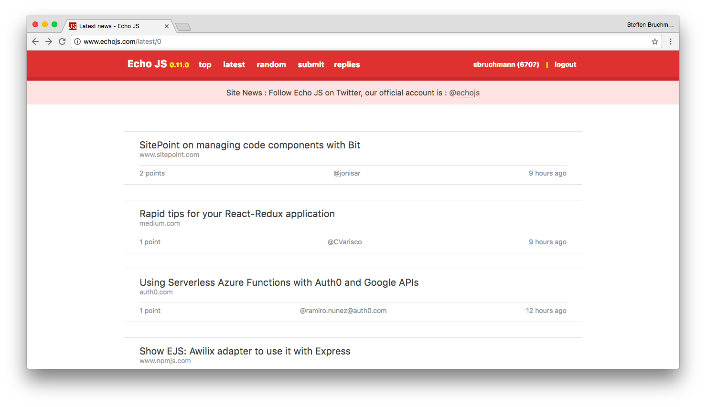

Refined Echo JS
===============

> Chrome extension that beautifies [Echo JS](http://www.echojs.com) and adds useful features

<h6 align="center">
This extension is <del>blatantly copied</del> highly inspired by <a href="https://github.com/sindresorhus/refined-github">Refined GitHub</a>.
</h6>

I visit Echo JS regularly and want to _modernize_ its design and functionalities.

My hope is that Echo JS will notice and implement some of these improvements.

Status
------

This is extension is currently work in progress. Feature and pull requests are
appreciated.

This is an [OPEN Open Source Project](http://openopensource.org/)
-----------------------------------------------------------------

Individuals making significant and valuable contributions are given
commit-access to the project to contribute as they see fit. This project
is more like an open wiki than a standard guarded open source project.
